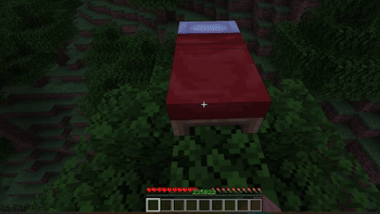
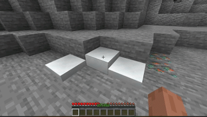
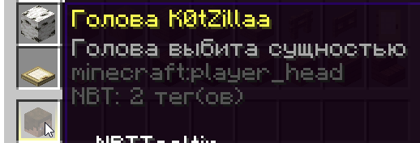

# 🪄 Функции

### Сообщение о пропуске дня и новая система фантомов

При наступлении дня пишется текущий день, и пишется, будут ли в текущие сутки спавниться фантомы. Шанс того, что фантомы будут спавниться, — 33%.

<figure><figcaption>
Сообщение о новом дне
</figcaption></figure>

### Изменение снежков

Теперь снежки можно подбирать со снега, если присесть и нажать на него правой кнопкой мыши.Теперь снежки можно подбирать со снега, если присесть и нажать на него правой кнопкой мыши.

<figure><figcaption>
Подбор снежков
</figcaption></figure>

При попадании снежка по игроку ему выдается эффект медлительности второго уровня.

<figure><figcaption>
Замедление от снежков
</figcaption></figure>

### Наручники

Внимание: наручниками может пользоваться только привилегированные группы лиц.\
Если переименовать железный самородок в «Наручники» и кликнуть ими правой кнопкой мыши по игроку, то этот игрок не сможет двигаться, не сможет умереть, не сможет даже прописать команду. Когда на человека надеваются наручники, в описании наручников пишется ник игрока, который привязывает эти наручники именно к этому игроку.\
Если взять наручники с ником игрока и стоять на расстоянии не более двух блоков от этого игрока, то этот игрок будет следовать за вами.

<figure><figcaption>
Работа наручников
</figcaption></figure>

### Обновление костной муки

Костная мука стала чуть полезнее, чем была раньше, ведь теперь вы можете взрастить кору обратно! Если вы нажмёте правой кнопкой мыши по обтёсанному дереву или бревну, то на нём вырастет кора.

<figure><figcaption>
Пример обновления костной муки
</figcaption></figure>

### Выпадение голов из игроков

Теперь при убийстве игрока топором из него будет выпадать голова, в описании которой будет написано, кто убил данного игрока. Также голова будет выпадать, если игрок был убит **брутальным пиглином** или **поборником**, но в этом случае будет написано, что голова была выбита сущностью.

<figure><figcaption>
Выпавшая голова с игрока
</figcaption></figure>
